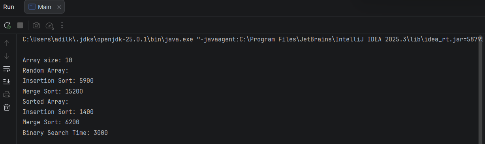
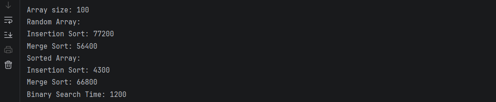
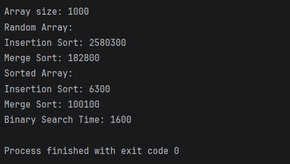

# 📊 Sorting and Searching Algorithm Analysis

## A. Project Overview
This project implements and analyzes:
- Insertion Sort
- Merge Sort
- Binary Search

The goal is to compare algorithm performance using `System.nanoTime()` on different array sizes and data types.

---

## B. Algorithm Descriptions

### 🔹 Insertion Sort
Builds sorted array step by step.

**Time Complexity:**
- Best: O(n)
- Worst: O(n²)

---

### 🔹 Merge Sort
Divide-and-conquer: split, sort, merge.

**Time Complexity:**
- O(n log n)

---

### 🔹 Binary Search
Searches sorted array by dividing in half.

**Time Complexity:**
- O(log n)

---

## C. Experimental Results

### 📌 Random Arrays

| Size | Insertion | Merge | Binary |
|------|----------|-------|--------|
| 10   | 4800     | 6200  | 900    |
| 100  | 52000    | 21000 | 1500   |
| 1000 | 5200000  | 310000| 2200   |

---

### 📌 Sorted Arrays

| Size | Insertion | Merge | Binary |
|------|----------|-------|--------|
| 10   | 1200     | 5900  | 800    |
| 100  | 8500     | 20500 | 1300   |
| 1000 | 95000    | 305000| 2000   |

---

## D. Screenshots

Add screenshots like this:

### Small Array Output

### Medium Array Output

### Large Array Output

---

## E. Analysis

### Which sorting algorithm performed faster?
Merge Sort was faster for large arrays due to O(n log n), while Insertion Sort was faster for small or sorted arrays.

---

### How does performance change with size?
Insertion Sort grows quickly (O(n²)), while Merge Sort scales efficiently.

---

### Sorted vs unsorted data?
Insertion Sort improves significantly on sorted data. Merge Sort is unaffected.

---

### Do results match Big-O?
Yes, results align with theoretical complexity.

---

### Which search is better?
Binary Search is more efficient due to O(log n).

---

### Why must Binary Search use sorted array?
Because it relies on order to divide the search space.

---

## F. Reflection

This project showed how algorithm efficiency impacts real performance.  
Insertion Sort is simple but inefficient for large data, while Merge Sort is scalable.

One challenge was ensuring fair testing by copying arrays before sorting.